# PixelWall

Collection of C programs that generate animations for a 16x22 pixel wall display, using [Raylib](https://www.raylib.com/) for graphics rendering.

## Prerequisites

Raylib must be pre-built and placed in `raylib/` at the repository root:

- **Linux (Raspberry Pi)**: `raylib/raylib-5.5-raspberry`
- **macOS**: `raylib/raylib-5.5-macos`
- **WASM**: `raylib/raylib-5.5-wasm`

## Building

```bash
make all              # Build pixelwall + utilities
make pixelwall        # Build main application only
make others           # Build utilities (test_grid, osc)
make wasm             # Build WebAssembly version (requires emscripten)
make docker-wasm      # WASM build via Docker
make clean            # Remove build artifacts
```

## Usage

```bash
./pixelwall [options]
```

### Global Options

| Option | Description | Default |
|--------|-------------|---------|
| `-d <design>` | Set design | `snake` |
| `-B <R,G,B>` | Background color | `0,0,0` |
| `-O <R,G,B>` | Border color | `0,0,0` |
| `-r <rows>` | Number of rows | `16` |
| `-c <cols>` | Number of columns | `22` |
| `-w <width>` | Window width | `1276` |
| `-H <height>` | Window height | `928` |
| `-F` | Flip horizontally | off |
| `-f <rate>` | Frame rate | `10` |
| `-b <size>` | Border size (0 to disable) | `4` |
| `-T <seconds>` | Auto-change design interval (0 to disable) | `0` |
| `-h` | Show help | |

### Keyboard Controls

| Key | Action |
|-----|--------|
| `SPACE` | Toggle data overlay |
| `F` | Flip horizontal |
| `V` | Toggle green tint |
| `,` / `.` | Previous / next design |
| `T` | Toggle timer display |

## Designs

### snake
Snake animation that moves around the grid.

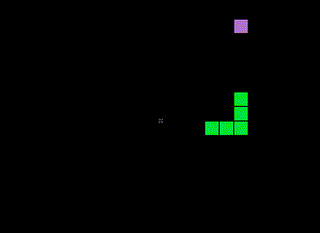

### random_pixels
Random colored pixels.

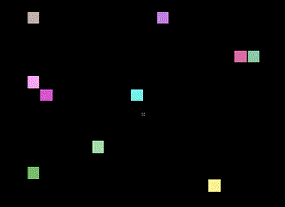

### text
Scrolling text display.

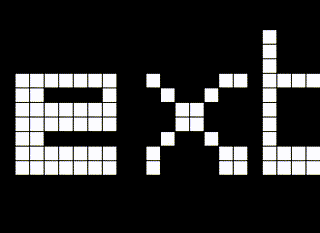

### pong
Self-playing Pong game.

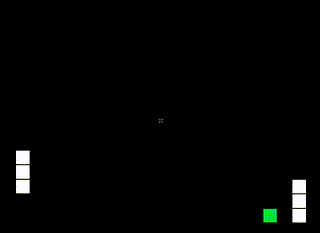

### life
Conway's Game of Life.

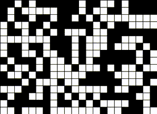

### cm5
CM5 blinking lights animation.

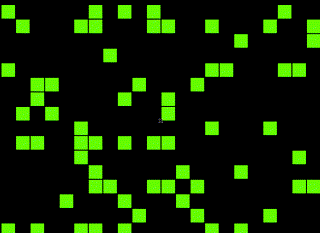

### text_arcade
Arcade-style scrolling text.

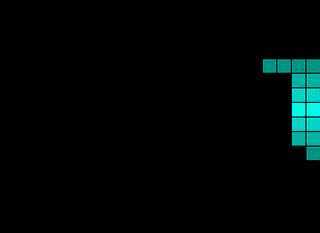

### clock
Digital clock with seconds marker.

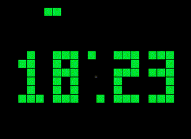

### breakout
Self-playing Breakout game. Use `-C` for colored mode.

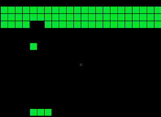 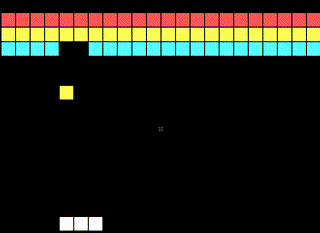

### tetris
Self-playing Tetris with AI placement. Use `-C` for colored mode with per-piece colors.
Color options: `-I` I-piece, `-Q` O-piece, `-K` T-piece, `-S` S-piece, `-Z` Z-piece, `-L` L-piece, `-J` J-piece, `-W` border.

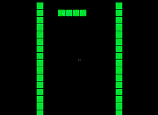 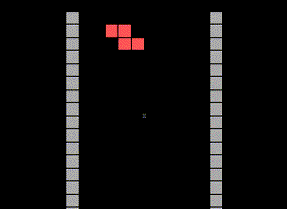

### starfield
Stars fly outward from center creating a warp speed effect. Use `-C` for brightness gradient.
Color options: `-D` dim color near center, `-R` bright color at edges.

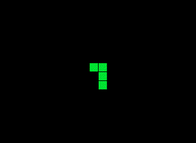 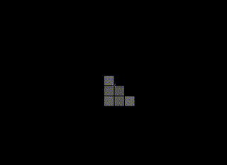

### invaders
Self-playing Space Invaders. Use `-C` for colored mode.
Color options: `-E` enemies, `-P` player, `-A` player bullet, `-K` enemy bullet.

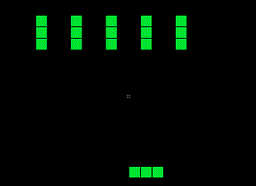 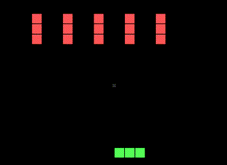

### alien_march
Animated Space Invader aliens scrolling across the screen like a marquee. Use `-C` for colored mode, `-R` to reverse direction, `-S <ticks>` to control scroll speed (default: 4), `-N <ticks>` to control animation speed (default: 1).
Color options: `-A` alien 1, `-G` alien 2, `-K` alien 3.

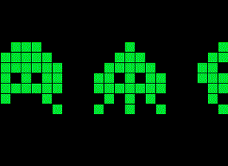 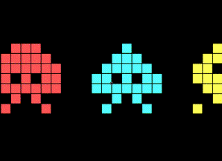

### pacman_march
Classic Pac-Man intermission: ghosts chase Pac-Man off screen, then Pac-Man chases scared (blue) ghosts back. Use `-C` for colored mode, `-S <ticks>` for scroll speed (default: 4), `-N <ticks>` for animation speed (default: 1).
Color options: `-P` Pac-Man, `-G` ghost 1, `-K` ghost 2, `-E` scared ghost.

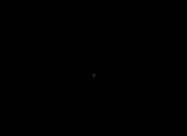 

### spritesheet
Load and animate sprite sheet images with 1:1 pixel rendering. Sprites are centered on the grid.

Options: `-I <path>` image file (required), `-G <CxR>` grid layout, `-W <WxH>` frame size, `-A <list>` frame indices (default: all frames in order), `-N <ticks>` animation speed, `-P <XxY>` offset from top-left, `-S <XxY>` spacing between frames, `-Z <factor>` zoom, `-K` use top-left pixel as transparent key color, `-E <tolerance>` key color tolerance.

### Examples

```bash
./pixelwall -d tetris                # Tetris in green
./pixelwall -d tetris -C             # Tetris with colored pieces
./pixelwall -d starfield -C          # Starfield with brightness gradient
./pixelwall -d invaders -C           # Space Invaders with colors
./pixelwall -d breakout -C           # Breakout with colored bricks
./pixelwall -d alien_march -C        # Animated aliens scrolling with colors
./pixelwall -d alien_march -R -S 6   # Slower scroll to the right
./pixelwall -d alien_march -S 2 -N 4 # Fast scroll, slow animation
./pixelwall -d pacman_march -C       # Pac-Man with classic colors
./pixelwall -T 30                    # Cycle through all designs every 30s
```

Run `./pixelwall -h` to see all design-specific options.

## License

[WTFPL](http://www.wtfpl.net/) - Do What The Fuck You Want To Public License.
